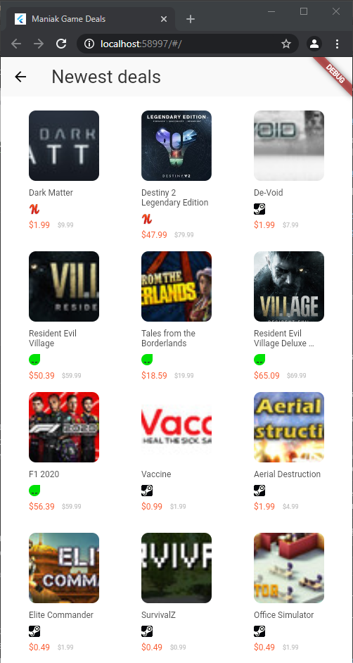

# maniak_game_deals

A new Flutter project.

## How to use

You can try the web version hosted on Github Pages here: https://testeurmaniak.github.io/game_deals_flutter/

## Screenshots

## TODO

### URL Support

* [x]  Steam
* [x]  Gamers Gate
* [x]  Green Man Gaming
* [ ]  Amazon
* [ ]  GameStop
* [ ]  Direct2Drive
* [x]  GoG
* [ ] URL Redirection: Origin
* [ ] URL Redirection: GetGamesGo
* [ ] URL Redirection: Shiny Loot
* [x] URL Redirection: Humble Bundle Store
* [ ] URL Redirection: Desura
* [ ] URL Redirection: Uplay
* [ ] URL Redirection: IndieGameStand