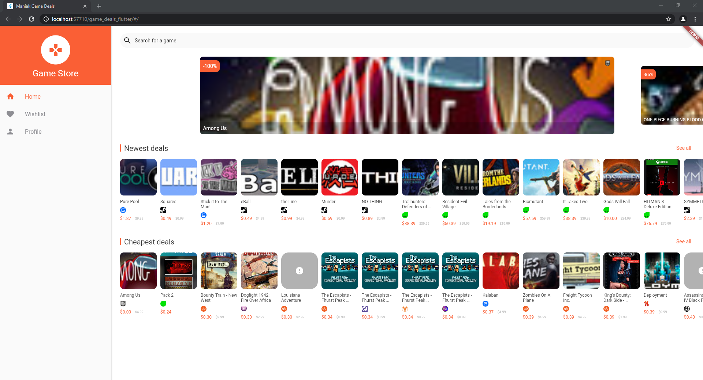
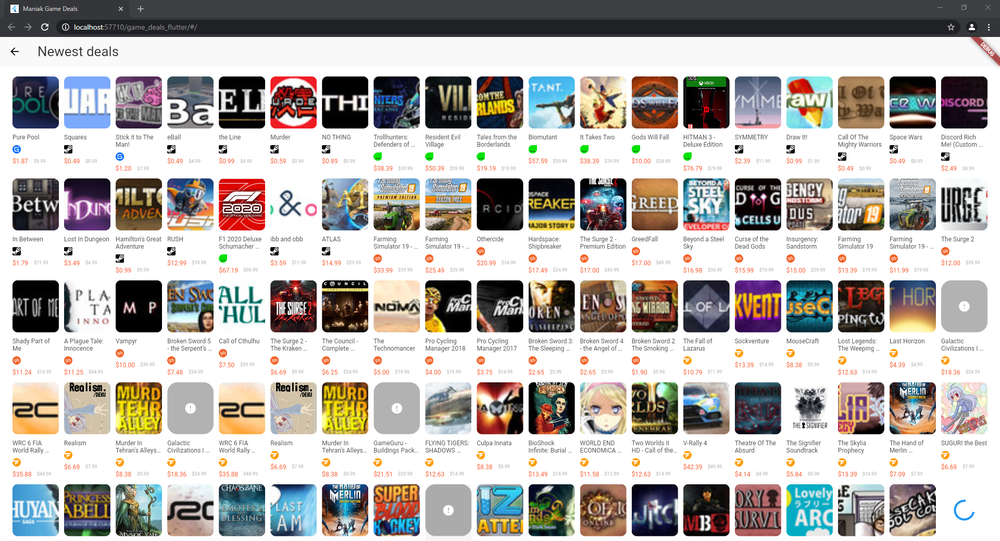

# maniak_game_deals

A cross-platform application using [CheapShark API](https://apidocs.cheapshark.com/) to display videogames deals on different websites.

## How to Install

### Web

You can try the web version hosted on [Github Pages](https://testeurmaniak.github.io/game_deals_flutter/).

### Android

_Coming soon on Google PlayStore. You can still build the source yourself if you want to try it._

### iOS

No release planned. You will need to build the iPA yourself.

## TODO

* [x] [Web Release](https://testeurmaniak.github.io/game_deals_flutter/)
* [ ] Android Release

### Design

* [ ] Application icon and favicon
* [ ] Web Spinner
* [ ] Add some more animations
* [ ] Dark theme

### URL Support

* [x]  Steam
* [x]  Gamers Gate
* [x]  Green Man Gaming
* [ ]  Amazon
* [ ]  GameStop
* [ ]  Direct2Drive
* [x]  GoG
* [x]  Origin
* [ ]  GetGamesGo
* [ ]  Shiny Loot
* [x]  Humble Bundle Store
* [ ]  Desura
* [ ]  Uplay
* [x]  Fanatical
* [ ]  GamesRocket
* [ ]  Games Republic
* [ ]  Sila Games Store
* [x]  WinGameStore
* [ ]  Funstock
* [x]  Gamebillet
* [ ]  Voidu
* [x]  Epic Games Store
* [x]  Gamesplanet
* [ ]  Gamesload
* [ ]  2Games
* [x]  Indie Gala
* [ ]  Battle.Net
* [ ]  All You Play

### Features

* [x] Lazy loading
* [ ] Search and Filters
* [ ] Deal's Data (ex: price evolution chart)
* [ ] Wishlist
* [ ] Profile/Settings

### Localization

* [x] English
* [ ] French

## Screenshots

## Credits

* [Phap Nguyen Huu](https://www.sketchappsources.com/free-source/2911-game-store-redesign-sketch-freebie-resource.html) - Design Inspiration
* [CheapShark](https://www.cheapshark.com/) - API